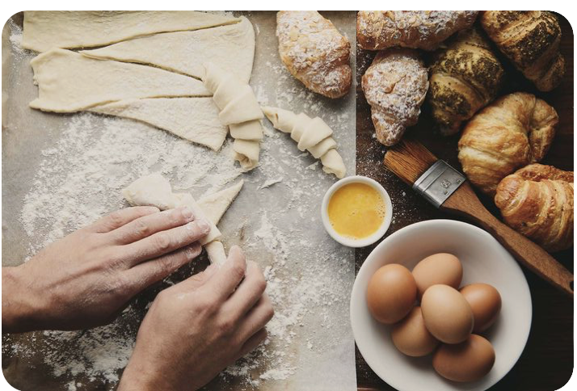

# Recetas
Index.html
<!DOCTYPE html>
<html lang="en">
    <head>
        <meta charset="UTF-8">
        <title>Recipes by Laura</title>

    </head>
    <body>
        <h1>Aprendiendo a sobrevivir</h1> 
        

        
Cocinar a sido para mí como ir al odontologo para muchos, lleno de miedo, ansiedad y un sin sabor de no saber que tan mal va a salir.

    
        
Asi que hoy les traigo tres recetas que les ayudaran a <strong>sobrevivir</strong> a eso que muchos llaman cocinar.

        <h3>Tres recetas para <em>"sobrevivir"</em></h3>

        <ol>
            <li>Receta sobrevivir a mi familia.</li> 
              <ul><a href="sobrevivir.html" target="_blank" rel="nooper noreferrer"><i>click aqui</i></a></ul>
            <li>Receta sobrevivir a mi pareja.</li>
              <ul><a href="enamorar.html" target="_blank" rel="nooper noreferrer"><i>click aqui</i></a></ul>
            <li>Receta sobrevivir a mi compañia.</li>
            <ul><a href="micompañia.html" target="_blank" rel="nooper noreferrer"><i>click aqui</i></a></ul>
        </ol>
    </body>
</html>
